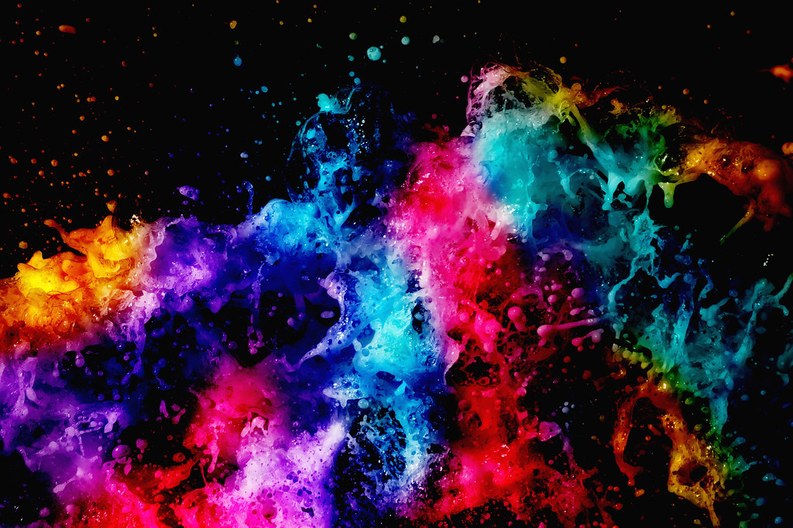

# Image Compression with Clustering
Uses KMeans clustering with 32 clusters.
Images are converted to (Nx3) vectors representing RGB color channels. Output image is generated by mapping each pixel to a cluster identified by that pixels label.
## Process
1) Read the image.
2) Convert image to n by 3 array (n pixels by 3 color channels).
3) Make KMeans object with number of colors as the number of clusters.
4) Fit KMeans to the pixel data.
5) Predict the cluster for each label using KMeans and assign the new color.
5) Create a new image with the new colors.
## Results
- Images were suprisingly good for reducing to only 32 colors but it still has visible artifacts.
  - Artifacts can be reduced with dithering and gamma correction.
## Future ideas
- Dithering (improved quality)
- Try HSB instead of RGB.
- Gamma correction.
## Before

## After
