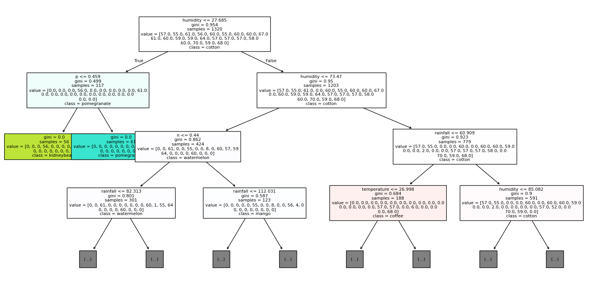

# Crop Recommendation Using Decision Trees
- Here is our [Dataset](https://www.kaggle.com/datasets/atharvaingle/crop-recommendation-dataset) from Kaggle.
- The goal of this project was to use environmental data to identify the crop that would grow the best.
- 40% of the data was used for training the model.
- A decision tree classifier was used to predict the best plant.
- Grid search was in charge of finding the best `depth` and `class_weight` (balanced or none). Balanced class weight means if there are less of that label they will have a higher weight in the predictions.
- The results are very different after each time the program is executed (train test split shuffling).
## Data fields
- `N` - percent of Nitrogen content in soil
- `P` - percent of Phosphorous content in soil
- `K` - percent of Potassium content in soil
- `temperature` - temperature in degree Celsius
- `humidity` - relative humidity in %
- `ph` - ph value of the soil
- `rainfall` - rainfall in mm
## Decision Tree Diagram
- Train Score is 1.000
- Test Score is 0.972
- Max depth was 15 (possible overfitting)
