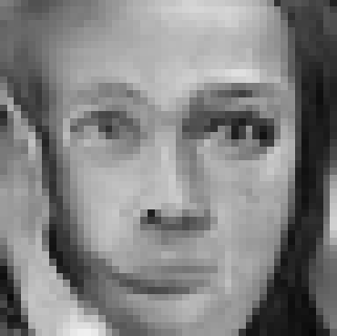
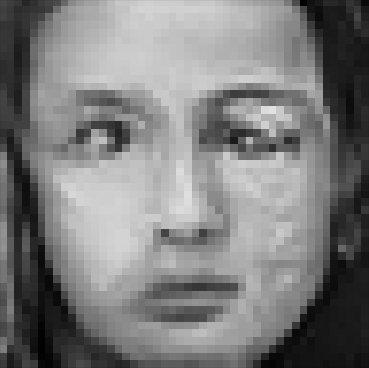
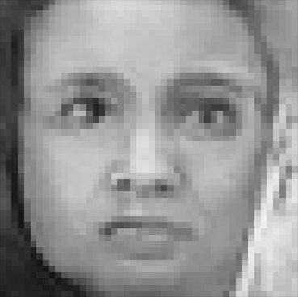

# GAN Image Generator
GAN stands for Generative Aversarial Network.
This technique for image generation uses two types of networks to train; a discriminator and a generator.
## Discriminator
Determines if an input image is from the original dataset. Output is a probability from 0 to 1, where 0 is if it isn't in the dataset and 1 if it is.
## Generator
Generates images from an input noise vector. Tries to generate images that look like ones from the original dataset to fool the discriminator.
## Results
Most are not great, but we've seen a lot of improvement with the later models. Check out some of these images we were able to generate!

<table>
  <tr>
    <td></td>
    <td></td>
  </tr>
  <tr>
    <td></td>
    <td></td>
  </tr>
</table>