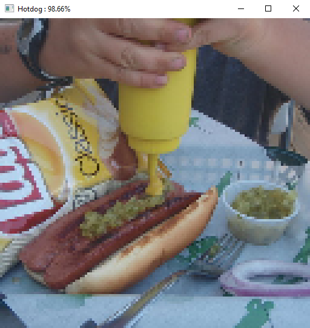

# 🌭 Hotdog | Not Hotdog Classification
- Click [here](https://www.kaggle.com/datasets/thedatasith/hotdog-nothotdog/data?select=hotdog-nothotdog) for the dataset.
- Classifies images hotdog or not hotdog using a convolutional neural network (CNN).
- Trained on 2121 images of hot dogs and other random food (not hotdogs).
- Has very good train score but very bad test score (overfitting).
  - Need a bigger dataset.

<table>
  <tr>
    <td></td>
    <td></td>
  </tr>
</table>