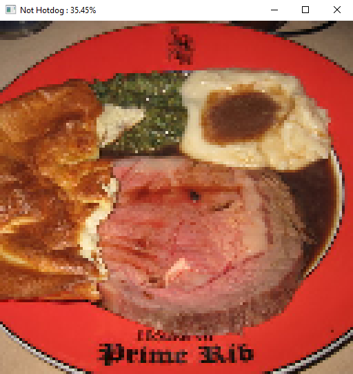

# 🌭 Hotdog | Not Hotdog Classification
- Click [here](https://www.kaggle.com/datasets/thedatasith/hotdog-nothotdog/data?select=hotdog-nothotdog) for the dataset.
- Classifies images hotdog or not hotdog using a convolutional neural network (CNN).
- Trained on 2121 images of hot dogs and other random food (not hotdogs).
- Inspired by Silicon Valley "Hot Dog" and… "Not Hot Dog".
## Dataset
- Contains 2121 images of hotdogs and other food each (4242 total).
- The images were not all the same size so I cropped them to have a 1:1 aspect ratio, 128x128 pixels.
## Model
- Uses convolution layers followed by leaky relu, dropout and maxpool.
- Dropout is only applied after the first convolutional layer.
- Maxpool is only applied after the second convolutional layer.
- Ends with a single linear layer to output a single number between 0 and 1 using the sigmoid activation function.
- Loss function is Binary Cross-Entropy Loss (BCELoss).
### Parameters
- `cp` is the checkpoint file (where the model is saved and loaded from).
- `epochs` the number of times the model trains on the entire dataset during training.
  - Set to 0 to skip training and just view the results.
- `batch_size` is how many images the model is trained on at a time.
- `lr` is how much the parameters of the model are adjusted after every batch.
- `save_every` is the number of epochs before the model is saved.
## Results
- Has very good train score (0.95) but very bad test score (0.6) (overfitting).
  - Need a bigger dataset.
  - Reduce size of model.
<table>
  <tr>
    <td></td>
    <td></td>
  </tr>
</table>