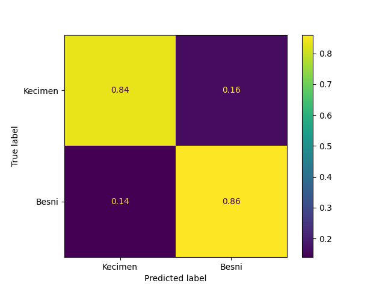

# Machine Learning
This is a repository for some of the Machine Learning projects I have worked on.

<div style="display: flex;">
  <div style="display: grid; grid-template-columns: repeat(2, 1fr); gap: 10px;">
    
    
  </div>
</div>

## My Beloved, the Iris Dataset
```python
import pandas as pd
import numpy as np
import matplotlib.pyplot as plt
import seaborn as sns
from sklearn.ensemble import RandomForestClassifier
from sklearn.metrics import confusion_matrix, ConfusionMatrixDisplay
from sklearn.model_selection import train_test_split, GridSearchCV

df = sns.load_dataset("iris")
y = df.iloc[:, -1].copy().to_numpy()
X = df.iloc[:, :-1].copy().to_numpy()
X_train, X_test, y_train, y_test = train_test_split(X, y, test_size=0.3)
params = {'max_depth': list(range(3,12))}
model = RandomForestClassifier(oob_score=True)
gs = GridSearchCV(model, param_grid=params, scoring='accuracy', n_jobs=-1)
gs.fit(X_train, y_train)
clf = gs.best_estimator_

print(f"Score (Train): {clf.score(X_train, y_train):.4f}")
print(f"Score (Test): {clf.score(X_test, y_test)}")
print(f"OOB Score: {clf.oob_score_:.4f}")

cm = confusion_matrix(y_test, clf.predict(X_test), normalize="true")
disp_cm = ConfusionMatrixDisplay(cm, display_labels=clf.classes_)
disp_cm.plot()
plt.show()

importances = pd.DataFrame(clf.feature_importances_, index=df.columns[:-1])
importances.plot.bar()
plt.tight_layout()
plt.show()
```